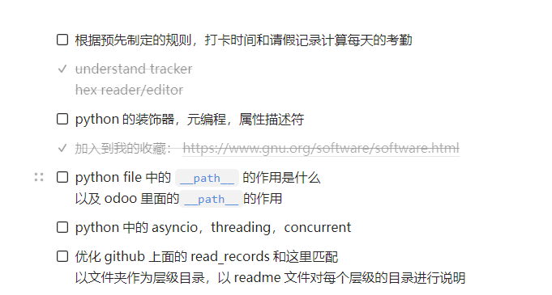

# Daily Collections

> 个人开发过程中的日常codes

## TODO List

- [x] [Markdown 语法](https://support.typora.io/zh/Markdown-Reference/)
- [X] python 编写单元测试
- [ ] excel utils
- [ ] 用check约束条件来确保column中的列
- [ ] make demo test record
- [x] RLock 与 Lock的区别
- [ ] logging 模块的使用

