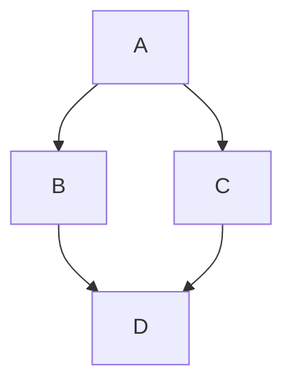

# Github-Markdown

> 这是GitHub风格的markdown。

## 基本的使用方式

### picture标签

<picture>
  <source media="(prefers-color-scheme: dark)" srcset="https://user-images.githubusercontent.com/25423296/163456776-7f95b81a-f1ed-45f7-b7ab-8fa810d529fa.png">
  <source media="(prefers-color-scheme: light)" srcset="https://user-images.githubusercontent.com/25423296/163456779-a8556205-d0a5-45e2-ac17-42d089e3c3f8.png">
  
</picture>

### 创建折叠段落

<details>
<summary>My top THINGS-TO-RANK</summary>

这是详细内容，这是详细内容，这是详细内容，<br/> 这是详细内容，这是详细内容，

</details>

看起来 Typora 对 `details` 标签支持不是很好。

### 格式化文字

| style         | Syntax           | Example                               |
| :------------ | ---------------- | ------------------------------------- |
| Strikethrough | `~~ ~~` or `~ ~` | ~~This was mistaken text~~            |
| Subscript     | `<sub> </sub>`   | This is a <sub>subscript</sub> text   |
| Superscript   | `<sup> </sup>`   | This is a <sup>superscript</sup> text |
| Underline     | `<ins> </ins>`   | This is an <ins>underlined</ins> text |

### 颜色模式

The background color is `#ffffff` for light mode and `#000000` for dark mode.

看起来typora并不支持颜色模式。

### Links

This site was built using [GitHub Pages](https://pages.github.com/)

让我们回到标题: [Title](#Github-Markdown).

### line break

- **在一句话后面加上两个空格**

  This example  
  Will span two lines

- **在第一行末尾添加反斜杠。**

  This example\
  Will span two lines

- **在第一行末尾添加一个 HTML 单行换行符标签。**

  This example<br/>
  Will span two lines

### 显示图片

使用相对链接


### 脚注 footnote

Here is a simple footnote[^1].

A footnote can also have multiple lines[^2].

[^1]: My reference.
[^2]: To add line breaks within a **footnote**, add 2 spaces to the end of a line.  
This is a second line.

### alerts

> [!NOTE]
> Useful information that users should know, even when skimming content.

> [!TIP]
> Helpful advice for doing things better or more easily.

> [!IMPORTANT]
> Key information users need to know to achieve their goal.

> [!WARNING]
> Urgent info that needs immediate user attention to avoid problems.

> [!CAUTION]
> Advises about risks or negative outcomes of certain actions.

警示语 （有时也称为标注或提示 ）是基于引用块语法的 Markdown 扩展，可用于强调关键信息。在 GitHub 上，它们会以不同的颜色和图标显示，以表明内容的重要性。

## 使用高级格式

### 使用表格

| Command      | Description                                        |
| ------------ | -------------------------------------------------- |
| `git status` | List all *new or modified* files                   |
| `git diff`   | Show file differences that **haven't been** staged |

### 创建关系图

可以使用以下四种不同的语法在 Markdown 中创建关系图：mermaid、geoJSON、topoJSON 和 ASCII STL。

#### Mermaid

一个mermaid的例子:



检查 mermaid的版本：

```mermaid
  info
```

#### 使用GeoJSON创建地图

```geojson
{
  "type": "FeatureCollection",
  "features": [
    {
      "type": "Feature",
      "id": 1,
      "properties": {
        "ID": 0
      },
      "geometry": {
        "type": "Polygon",
        "coordinates": [
          [
              [-90,35],
              [-90,30],
              [-85,30],
              [-85,35],
              [-90,35]
          ]
        ]
      }
    }
  ]
}
```

### 数学表达式

一般来说，数学表达式都使用 latex 语法。

