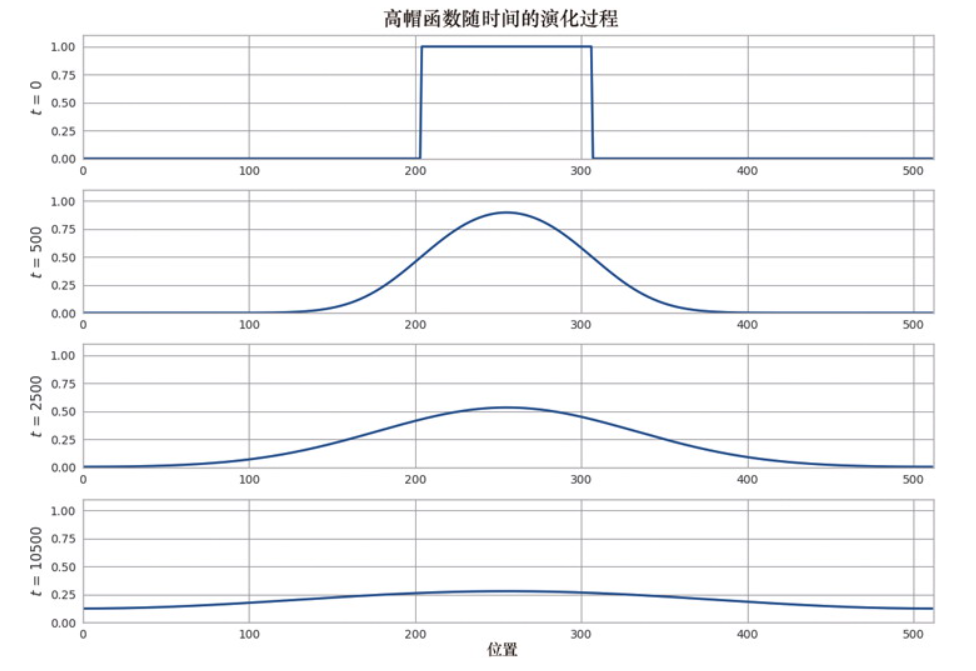

# high performance python

## 2. profiling

### 2.1 性能分析的方式

timeit , time.time() 分析执行时间。可选的工具 linux `/usr/bin/time`

cProfile 分析函数的执行时长。

line_profiler 分析每行执行的情况。

使用perf stat来搞明白以下两个方面：最终在CPU中执行了多少个指令；CPU缓存的利用情况。

使用py-spy来了解正在运行的Python进程。

memory_profiler:适用于在带标注的图表中跟踪一段时间内RAM的占用量

### 使用cProfile分析函数执行时长

`python -m cProfile -s cumulative calc_julia.py`

```
Length of x: 1000
Total elements: 1000000
         36257474 function calls (36256666 primitive calls) in 11.141 seconds

   Ordered by: cumulative time

   ncalls  tottime  percall  cumtime  percall filename:lineno(function)
     24/1    0.000    0.000   11.141   11.141 {built-in method builtins.exec}
        1    0.021    0.021   11.141   11.141 calc_julia.py:1(<module>)
        1    0.469    0.469   11.050   11.050 calc_julia.py:88(calc_pure_python)
        1    7.857    7.857   10.448   10.448 calc_julia.py:74(calculate_z_serial_purepython)
 34219980    2.591    0.000    2.591    0.000 {built-in method builtins.abs}
  2003867    0.129    0.000    0.129    0.000 {method 'append' of 'list' objects}
     37/3    0.000    0.000    0.069    0.023 <frozen importlib._bootstrap>:1165(_find_and_load)
     37/3    0.000    0.000    0.069    0.023 <frozen importlib._bootstrap>:1120(_find_and_load_unlocked)
     35/3    0.000    0.000    0.066    0.022 <frozen importlib._bootstrap>:666(_load_unlocked)
     22/2    0.000    0.000    0.066    0.033 <frozen importlib._bootstrap_external>:934(exec_module)
     81/5    0.000    0.000    0.066    0.013 <frozen importlib._bootstrap>:233(_call_with_frames_removed)
 ......
```

为更好地展现cProfile的结果，可将其写入一个统计文件，再使用Python对这个文件进行分析：

`python -m cProfile -o profile.status calc_julia.py`

下面是关于这个文件的使用方式：

```
In [1]: import pstats

In [2]: p = pstats.Stats("profile.status")

In [3]: p.sort_stats("cumulative")
Out[3]: <pstats.Stats at 0x2e418961e50>

In [4]: p.print_stats()

In [5]: p.print_callers()
   Ordered by: cumulative time

```

### 使用SnakeViz可视化cProfile的输出

`snakeviz profile.status`

### 2.8 使用line_profiler

命令行:

`kernprof -l -v julia1_lineprofiler.py`

输出结果如下：

```
Wrote profile results to 'julia1_lineprofiler.py.lprof'
Timer unit: 1e-06 s

Total time: 34.7942 s
File: julia1_lineprofiler.py
Function: calculate_z_serial_purepython at line 12

Line #      Hits         Time  Per Hit   % Time  Line Contents
==============================================================
    12                                           @profile
    13                                           def calculate_z_serial_purepython(maxiter, zs, cs):
    14                                               """Calculate output list using Julia update rule"""
    15         1       1447.4   1447.4      0.0      output = [0] * len(zs)
    16   1000001     149277.7      0.1      0.4      for i in range(len(zs)):
    17   1000000     142136.4      0.1      0.4          n = 0
    18   1000000     202323.4      0.2      0.6          z = zs[i]
    19   1000000     164962.6      0.2      0.5          c = cs[i]
    20  34219980   16384883.2      0.5     47.1          while abs(z) < 2 and n < maxiter:
    21  33219980   10148116.0      0.3     29.2              z = z * z + c
    22  33219980    7369152.5      0.2     21.2              n += 1
    23   1000000     231857.6      0.2      0.7          output[i] = n
    24         1          8.8      8.8      0.0      return output

Total time: 43.7249 s
File: julia1_lineprofiler.py
Function: calc_pure_python at line 27

Line #      Hits         Time  Per Hit   % Time  Line Contents
==============================================================
    27                                           @profile
    28                                           def calc_pure_python(draw_output, desired_width, max_iterations):
    29                                               """Create a list of complex co-ordinates (zs) and complex parameters (cs), build Julia set and display"""
    30         1          7.5      7.5      0.0      x_step = (x2 - x1) / desired_width
    31         1          0.7      0.7      0.0      y_step = (y1 - y2) / desired_width
    32         1          0.4      0.4      0.0      x = []
    33         1          0.3      0.3      0.0      y = []
    34         1          0.4      0.4      0.0      ycoord = y2
    35      1001        147.9      0.1      0.0      while ycoord > y1:
    36      1000        224.2      0.2      0.0          y.append(ycoord)
    37      1000        157.4      0.2      0.0          ycoord += y_step
    38         1          0.1      0.1      0.0      xcoord = x1
    39      1001        124.7      0.1      0.0      while xcoord < x2:
    40      1000        174.0      0.2      0.0          x.append(xcoord)
    41      1000        131.1      0.1      0.0          xcoord += x_step
    42                                               # set width and height to the generated pixel counts, rather than the
    43                                               # pre-rounding desired width and height
    44                                               # build a list of co-ordinates and the initial condition for each cell.
    45                                               # Note that our initial condition is a constant and could easily be removed,
    46                                               # we use it to simulate a real-world scenario with several inputs to our function
    47         1          0.1      0.1      0.0      zs = []
    48         1          0.5      0.5      0.0      cs = []
    49      1001        122.3      0.1      0.0      for ycoord in y:
    50   1001000     106730.5      0.1      0.2          for xcoord in x:
    51   1000000     341486.7      0.3      0.8              zs.append(complex(xcoord, ycoord))
    52   1000000     365322.7      0.4      0.8              cs.append(complex(c_real, c_imag))
    53
    54         1        286.1    286.1      0.0      print("Length of x:", len(x))
    55         1        228.2    228.2      0.0      print("Total elements:", len(zs))
    56         1          4.7      4.7      0.0      start_time = time.time()
    57         1   42903719.9 4.29e+07     98.1      output = calculate_z_serial_purepython(max_iterations, zs, cs)
    58         1          3.9      3.9      0.0      end_time = time.time()
    59         1          1.2      1.2      0.0      secs = end_time - start_time
    60         1        215.5    215.5      0.0      print(calculate_z_serial_purepython.__name__ + " took", secs, "seconds")
    61
    62         1       5812.3   5812.3      0.0      assert sum(output) == 33219980  # this sum is expected for 1000^2 grid with 300 iterations
```

### 2.9 使用memory_profiler

### 2.10 使用py-spy

安装：`uv add py-spy`

```
py-spy record -o record.svg -- python julia1_lineprofiler.py
Error: Failed to find python version from target process
```

### 2.11 查看字节码

使用dis来查看函数的字节码

```
In [1]: import dis

In [2]: import julia1_lineprofiler
Length of x: 1000
Total elements: 1000000
calculate_z_serial_purepython took 3.8175511360168457 seconds

In [3]: dis.dis(julia1_lineprofiler.calculate_z_serial_purepython)
 16           0 RESUME                   0

 19           2 LOAD_CONST               1 (0)
              4 BUILD_LIST               1
              6 LOAD_GLOBAL              1 (NULL + len)
             18 LOAD_FAST                1 (zs)
             20 PRECALL                  1
             24 CALL                     1
             34 BINARY_OP                5 (*)
             38 STORE_FAST               3 (output)

 20          40 LOAD_GLOBAL              3 (NULL + range)
             52 LOAD_GLOBAL              1 (NULL + len)
             64 LOAD_FAST                1 (zs)
             66 PRECALL                  1
             70 CALL                     1
```

## 6. 矩阵向量计算

为探索矩阵和向量计算，我们将反复以液体扩散为例。扩散是移动液体并使其均匀混合的机制之一。

```math
\frac{\partial}{\partial t} \boldsymbol{u}(x, t)=D \cdot \frac{\partial^{2}}{\partial x^{2}} \boldsymbol{u}(x, t)
```

在这个方程中，`u`是表示液体量的向量。例如，可使用值为0的向量表示只有水，使用值为1的向量表示只有染料（值位于这两者之间的向量表示混合了两种液体）。

我们将使用离散体积和离散时间来逼近在时空上连续的扩散方程，为此我们将使用欧拉法。欧拉法以差分形式表示导数：

```math
\frac{\partial}{\partial t} \boldsymbol{u}(x, t) \approx \frac{\boldsymbol{u}(x, t+\mathrm{d} t)-\boldsymbol{u}(x, t)}{\mathrm{d} t}
```

其中`dt`是一个固定值。这个固定值表示时间步长，即要在什么样的时间分辨率上求解方程。

因此，可重写这个方程，在给定`u(x,t)`的情况下，计算出`u(x, t + dt)`的值。这意味着可以从某种初始状态（`u(x,0)`，表示将一滴染料滴入一杯水中时）开始，根据刚才概述的计算状态的演化过程，看看未来的状态(`u(x,dt)`)是什么样的。这种问题被称为初始值问题或柯西问题(Cauchy problem)。

对于x轴上的导数，可以用类似方式使用有限差分近似，得到最终的方程，如下所示：

```math
\boldsymbol{u}(x, t+\mathrm{d} t)=\boldsymbol{u}(x, t)+\mathrm{d} t \cdot D \cdot \frac{\boldsymbol{u}(x+\mathrm{d} x, t)+\boldsymbol{u}(x-\mathrm{d} x, t)-2 \cdot \boldsymbol{u}(x, t)}{\mathrm{d} x^{2}}
```

与`dt`表示帧率类似，其中的`dx`表示图像分辨率：`dx`越小，矩阵中每个单元格表示的区域就越小。

对于我们要计算的每个时点的值，都可以使用一个矩阵来存储。因此，至少需要两个矩阵：一个用于存储液体当前的状态，另一个用于存储液体的下一个状态。

```python
# Create the initial conditions
u = vector of length N
for i in range(N):
    u = 0 if there is water, 1 if there is dye
# Evolve the initial conditions
D = 1
t = 0
dt = 0.0001
while True:
    print(f"Current time is: {t}")
    unew = vector of size N
　
    # Update step for every cell
    for i in range(N):
        unew[i] = u[i] + D * dt * (u[(i+1)٪N] + u[(i-1)٪N] - 2 * u[i])
    # Move the updated solution into u
    u = unew
　
    visualize(u)
```

这些代码根据水中染料的初始状态，计算出时间每流逝0.0001秒，整个系统是什么样的。结果如图6-1所示:



二维方程（以及求解代码）唯一的不同之处在于，还必须考虑y轴的二阶导数。这意味着需要将原来的扩散方程修改成下面这样：

```math
\frac{\partial}{\partial t} \boldsymbol{u}(x, y, t)=D \cdot\left(\frac{\partial^{2}}{\partial x^{2}} \boldsymbol{u}(x, y, t)+\frac{\partial^{2}}{\partial y^{2}} \boldsymbol{u}(x, y, t)\right)
```

使用前面的方法将这个二维扩散方程转换为伪代码：

```python
for i in range(N):
    for j in range(M):
        unew[i][j] = u[i][j] + dt * (
            (u[(i + 1) % N][j] + u[(i - 1) % N][j] - 2 * u[i][j]) + # d^2 u / dx^2
            (u[i][(j + 1) % M] + u[i][(j - 1) % M] - 2 * u[i][j]) # d^2 u / dy^2
        )
```

### 6.2 纯python的方式运行

```python
"""
diffusion_python.py


created at 2026-05-22
"""

import time

from line_profiler import profile

grid_shape = (640, 640)


@profile
def evolve(grid, dt, D=1.0):
    xmax, ymax = grid_shape
    new_grid = [[0.0 for _ in range(grid_shape[1])] for _ in range(grid_shape[0])]

    for i in range(xmax):
        for j in range(ymax):
            grid_xx = grid[(i + 1) % xmax][j] + grid[(i - 1) % xmax][j] - 2.0 * grid[i][j]
            grid_yy = grid[i][(j + 1) % ymax] + grid[i][(j - 1) % ymax] - 2.0 * grid[i][j]
            new_grid[i][j] = grid[i][j] + D * (grid_xx + grid_yy) * dt
    return new_grid


def run_experiment(num_iterations):
    # setting up initial conditions
    grid = [[0.0 for _ in range(grid_shape[1])] for _ in range(grid_shape[0])]

    block_low = int(grid_shape[0] * 0.4)
    block_high = int(grid_shape[0] * 0.5)
    for i in range(block_low, block_high):
        for j in range(block_low, block_high):
            grid[i][j] = 0.005

    start = time.time()
    for i in range(num_iterations):
        grid = evolve(grid, 0.1)
    return time.time() - start


if __name__ == "__main__":
    run_experiment(500)

```

```
kernprof -lv diffusion_python.py
Wrote profile results to 'diffusion_python.py.lprof'
Timer unit: 1e-06 s

Total time: 6.8645 s
File: diffusion_python.py
Function: evolve at line 15

Line #      Hits         Time  Per Hit   % Time  Line Contents
==============================================================
    15                                           @profile
    16                                           def evolve(grid, dt, D=1.0):
    17        10         19.7      2.0      0.0      xmax, ymax = grid_shape
    18        10     443494.2  44349.4      6.5      new_grid = [[0.0 for _ in range(grid_shape[1])] for _ in range(grid_shape[0])]
    19
    20      6410        786.2      0.1      0.0      for i in range(xmax):
    21   4102400     487045.3      0.1      7.1          for j in range(ymax):
    22   4096000    2252187.7      0.5     32.8              grid_xx = grid[(i + 1) % xmax][j] + grid[(i - 1) % xmax][j] - 2.0 * grid[i][j]
    23   4096000    2143980.2      0.5     31.2              grid_yy = grid[i][(j + 1) % ymax] + grid[i][(j - 1) % ymax] - 2.0 * grid[i][j]
    24   4096000    1536974.8      0.4     22.4              new_grid[i][j] = grid[i][j] + D * (grid_xx + grid_yy) * dt
    25        10          7.2      0.7      0.0      return new_grid

```

`new_grid = [[0.0 for _ in range(grid_shape[1])] for _ in range(grid_shape[0])]`: 不管你将什么样的值传递给evolve，new_grid列表的形状和大小始终不变，且包含的值也相同。一种简单的优化是，只分配这个列表一次，并在需要时重用它.

```
Wrote profile results to 'diffusion_python_memory.py.lprof'
Timer unit: 1e-06 s

Total time: 6.5504 s
File: diffusion_python_memory.py
Function: evolve at line 14

Line #      Hits         Time  Per Hit   % Time  Line Contents
==============================================================
    14                                           @profile
    15                                           def evolve(grid, dt, out, D=1.0):
    16        10         15.2      1.5      0.0      xmax, ymax = grid_shape
    17      6410        844.3      0.1      0.0      for i in range(xmax):
    18   4102400     515039.1      0.1      7.9          for j in range(ymax):
    19   4096000    2273849.1      0.6     34.7              grid_xx = grid[(i + 1) % xmax][j] + grid[(i - 1) % xmax][j] - 2.0 * grid[i][j]
    20   4096000    2188745.8      0.5     33.4              grid_yy = grid[i][(j + 1) % ymax] + grid[i][(j - 1) % ymax] - 2.0 * grid[i][j]
    21   4096000    1571908.9      0.4     24.0              out[i][j] = grid[i][j] + D * (grid_xx + grid_yy) * dt

```

### 使用pref分析

谓冯·诺依曼瓶颈，指的是内存和CPU之间的带宽是有限的，这是由现代计算机使用的分层存储架构导致的。如果能够快速移动大量数据，就根本不需要高速缓存，因为CPU可立即获得所需的任何数据。在这种情况下，根本就不存在所谓的冯·诺依曼瓶颈。

由于无法快速移动大量数据，因此必须预先从内存中取回数据，并将其存储在容量更小但速度更快的CPU高速缓存中，这样才有可能在CPU需要某项数据时，它已经位于可快速读取的地方。

在Linux中，可使用工具perf非常深入地了解CPU是如何处理当前运行的程序的。

```
$ perf stat -e cycles,instructions,\
    cache-references,cache-misses,branches,branch-misses,task-clock,faults,\
    minor-faults,cs,migrations python diffusion_python_memory.py
　
　
Performance counter stats for 'python diffusion_python_memory.py':
　
  415,864,974,126     cycles                    #    2.889 GHz
1,210,522,769,388     instructions              #    2.91 insn per cycle
      656,345,027     cache-references          #    4.560 M/sec
      349,562,390     cache-misses              #   53.259 ٪ of all cache refs
  251,537,944,600     branches                  # 1747.583 M/sec
    1,970,031,461     branch-misses             #    0.78٪ of all branches
    143934.730837     task-clock (msec)         #    1.000 CPUs utilized
           12,791     faults                    #    0.089 K/sec
           12,791     minor-faults              #    0.089 K/sec
              117     cs                        #    0.001 K/sec
                6     migrations                #    0.000 K/sec
　
    143.935522122 seconds time elapsed
```

#### 理解pref相关的指标

task-clock指出任务占用了多少个时钟周期，这不同于总运行时间，因为如果程序的运行时间为1s，但使用了两个CPU，那么task-clock将为2000（task-clock的单位通常是ms）。

Instructions指出代码发出了多少条CPU指令

cycles指出为执行这些指令占用了多少个CPU周期。这两个数字之间的差异指出了代码在向量化和流水线化方面的情况如何

cs（表示context switches）和CPU-migrations指出了程序为等待内核操作（如I/O）完成而停顿（并让其他应用程序运行）的情况以及将当前执行切换到另一个CPU核心的情况。

一旦数据进入内存并被引用后，它将进入各个高速缓存层（L1/L2/L3高速缓存）。每次引用高速缓存中的数据时，指标cache-references的值都将增大。如果高速缓存中没有所需的数据，需要从内存获取，其被视为高速缓存缺失。

### 使用numpy

```python
'''
In [4]: vec = list(range(1000000))

In [5]: %timeit norm_square_list(vec)
39.7 ms ± 465 μs per loop (mean ± std. dev. of 7 runs, 10 loops each)

In [6]: %timeit norm_square_list_comprehension(vec)
66.9 ms ± 6.72 ms per loop (mean ± std. dev. of 7 runs, 10 loops each)

In [7]: vec_array = array('l', range(1000000))

In [8]: %timeit norm_square_array(vec_array)
48.6 ms ± 829 μs per loop (mean ± std. dev. of 7 runs, 10 loops each)

In [9]: vec_np = np.arange(1000000)

In [10]: %timeit norm_square_numpy(vec_np)
2.37 ms ± 31.4 μs per loop (mean ± std. dev. of 7 runs, 100 loops each)

In [11]: %timeit norm_square_numpy_dot(vec_np)
423 μs ± 12.1 μs per loop (mean ± std. dev. of 7 runs, 1,000 loops each)

In [12]:
'''

from array import array

import numpy as np


def norm_square_list(vector):
    norm = 0
    for v in vector:
        norm += v * v
    return norm


def norm_square_list_comprehension(vector):
    return sum([v * v for v in vector])


def norm_square_array(vector):
    norm = 0
    for v in vector:
        norm += v * v
    return norm


def norm_square_numpy(vector):
    return np.sum(vector * vector)


def norm_square_numpy_dot(vector):
    return np.dot(vector, vector)

```

